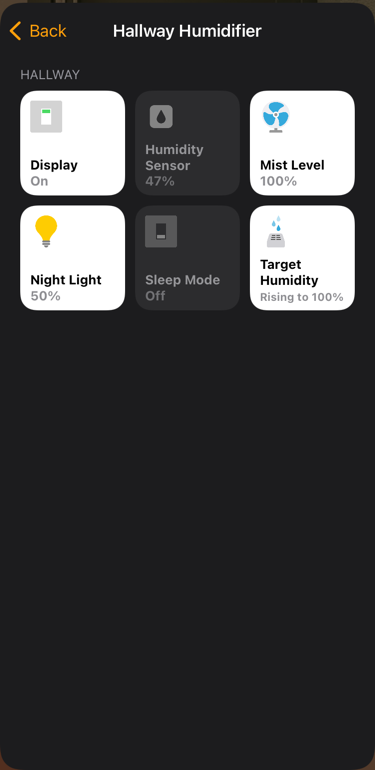
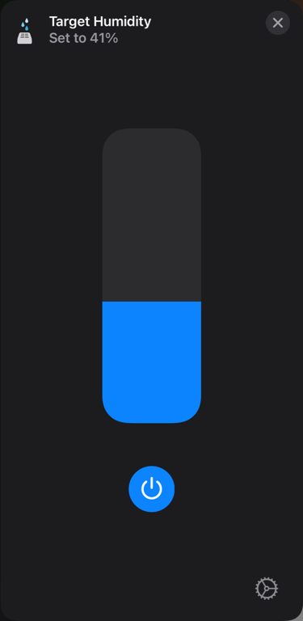
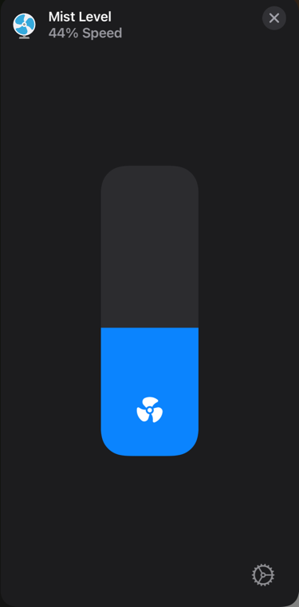
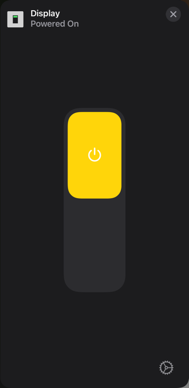
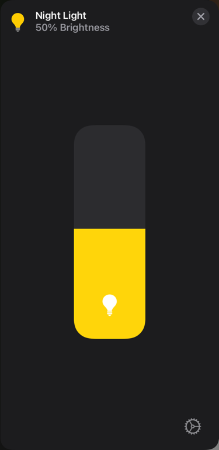
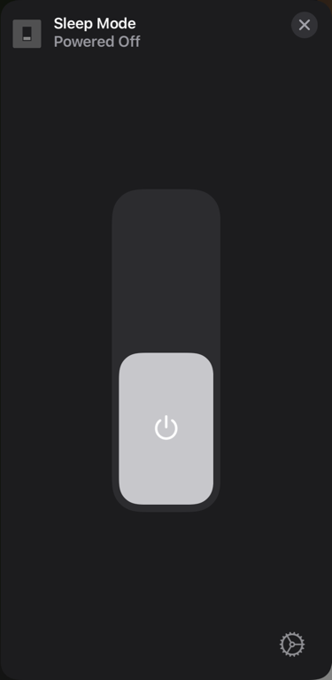
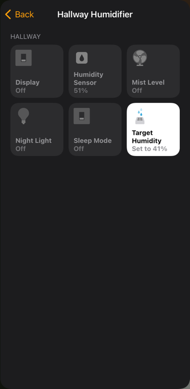
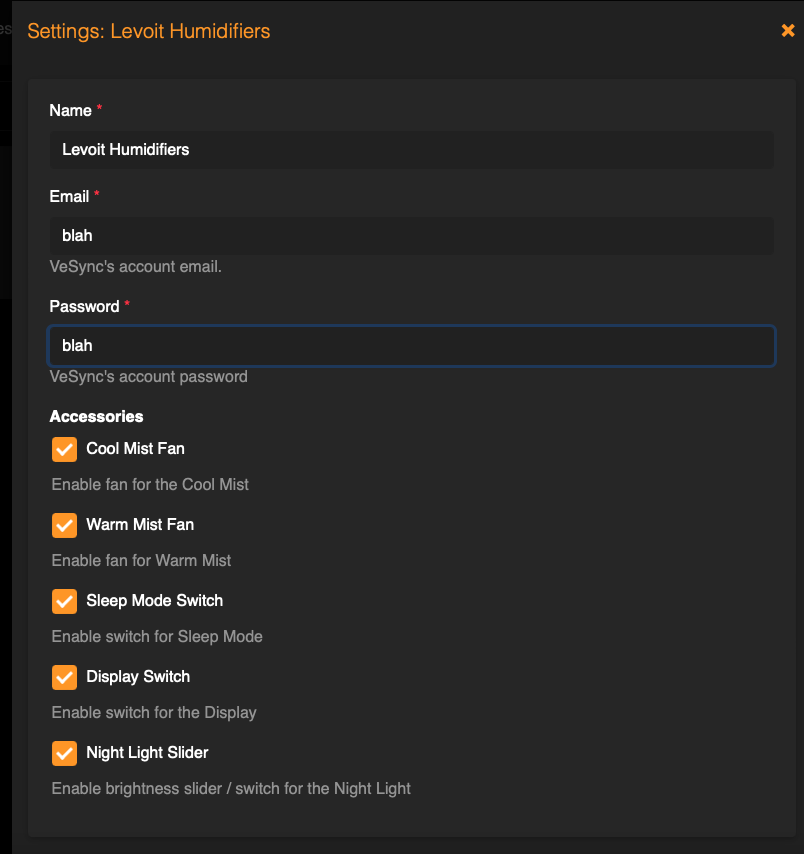

# Homebridge Levoit Humidifiers

[](https://github.com/homebridge/homebridge/wiki/Verified-Plugins)
[](https://discord.com/channels/432663330281226270/1055705874460594247)
[](https://www.npmjs.com/package/homebridge-levoit-humidifiers)

This is a Homebridge plugin to control Levoit Humidifiers from Apple HomeKit.

| Supported Versions | Auto / Humidity | Mist | Sleep | Light | Display | Warm |
| ------------------ | --------------- | ---- | ----- | ----- | ------- | ---- |
| Superior 6000S     | ✅              | ✅   | ✅    | ❌    | ✅      | ❌   |
| OasisMist 1000S    | ✅              | ✅   | ✅    | ❌    | ✅      | ❌   |
| OasisMist 600S     | ✅              | ✅   | ✅    | ❌    | ✅      | ✅   |
| OasisMist 450S     | ✅              | ✅   | ✅    | ❌    | ✅      | ✅   |
| LV600S             | ✅              | ✅   | ✅    | ❌    | ✅      | ✅   |
| Classic 300S       | ✅              | ✅   | ✅    | ✅    | ✅      | ❌   |
| Classic 200S       | ✅              | ✅   | ❌    | ❌    | ✅      | ❌   |
| Dual 200S          | ✅              | ✅   | ❌    | ✅    | ✅      | ❌   |

### Features (if supported by model)

1. Humidifier / Auto Mode
    - Sets humidifier to Auto / Humidity and sets the Target Humidity to the desired level.
    - Can also change Target Humidity in Sleep Mode, except on LV600 / Oasis.
        - For LV600s and Oasis, the Humidifier slider will be set to 0% when Sleep Mode is on.
    - For LV600s and Oasis, the Auto humidity range is 40-80%. All other models are 30-80%.
        - Selecting values outside the Auto range will set the Target Humidity to the lowest or highest number in the
          range.

2. Mist Level
    - Sets humidifier to Manual mode unless model supports changing mist levels in Auto / Humidity mode, and sets Mist level.
    - When set to Level 0, turns the device off.

3. Warm Mist Level
    - Sets Warm Mist Level to the desired level.

4. Sleep Mode
    - This switches the device between Sleep Mode (On) and Auto Mode (Off)
    - Sleep Mode Target Humidity is controlled by the Target Humidity slider, except on LV600s / Oasis.
    - On LV600s / Oasis, Sleep Mode Target Humidity is set by VeSync at 50–60% and cannot be changed.
    - The LV600s / Oasis turns off Warm Mist by default to keep the humidifier quiet. It can be turned back on with the Warm
      Mist slider.

5. Night Light
    - 4 brightness levels

6. Display Toggle
    - Toggles the display on/off

7. Humidity Sensor
    - Sensor that displays current Humidity %

### Details

<a href="url"></a>
<a href="url"></a>
<a href="url"></a>
<a href="url"></a>
<a href="url"></a>
<a href="url"></a>
<a href="url"></a>

### Configuration

* Via the Homebridge UI, enter the Homebridge VeSync Client plugin settings.
* Enter your VeSync app credentials.
* Select which controls you want exposed. Humidity / Auto Mode can not be hidden.
* Setup the platform plugin as a child bridge for better performance
* Save and restart Homebridge.

This plugin requires your VeSync credentials as it communicates with the VeSync devices via VeSync's own API. Your
credentials are only stored in the Homebridge config and not sent to any server except VeSync's.

You can also do this directly via the Homebridge config by adding your credentials to the config file under platforms.
Replace the values of `username` and `password` with your credentials.

You can turn off optional controls via the `accessories` section of the config or through the plugin UI settings. The
Humidifier (Auto mode) slider cannot be turned off and will always be exposed.

Via UI:



Via config.json:

```json
{
  "platforms": [
    {
      "name": "Levoit Humidifiers",
      "email": "email",
      "password": "password",
      "platform": "LevoitHumidifiers",
      "accessories": {
        "display": false,
        "sleep_mode": false,
        "mist": false,
        "warm_mist": false,
        "night_light": false,
        "auto_pro": false,
        "humidity_sensor": true
      },
      "options": {
        "showOffWhenDisconnected": false
      }
    }
  ]
}
```

### Note to Seasonal Humidifier Users:

By default, if you disconnect a humidifier from WiFi, it will begin showing as "Not Responding" in HomeKit. Restarting
Homebridge will remove the cached device from HomeKit. Once you've re-connected the humidifier, restart Homebridge again
for it to display back in HomeKit. 

If you prefer the disconnected device to be visible in HomeKit at all times, 
set `showOffWhenDisconnected` to `true` in the config. The humidifiers will remain in HomeKit in an Off state.
**Note: This will cause benign errors in the Homebridge logs that the device could not be contacted.**

### Enabling Debug Mode

In the config file, add `enableDebugMode: true`

```json
{
  "platforms": [
    {
      "name": "Levoit Humidifiers",
      "email": "email",
      "password": "password",
      "platform": "LevoitHumidifiers",
      "enableDebugMode": true
    }
  ]
}
```

### Local Development

To setup the local project, clone this repo and run the following from the root directory:

```
yarn install
```

To run locally, make sure to install Homebridge locally, and then run:

```
yarn watch
```
